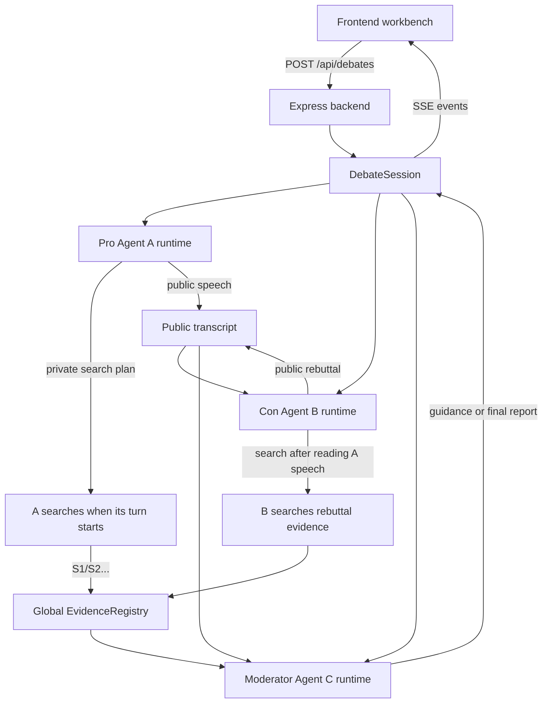
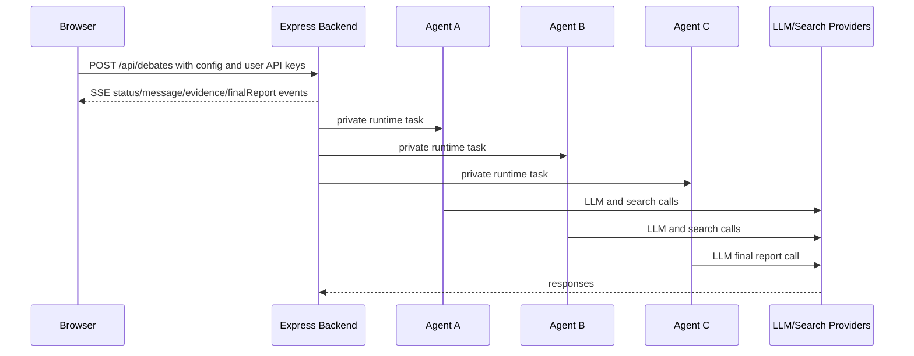

<p align="right">
  <a href="./README.md">简体中文</a> | <a href="./README.zh-TW.md">繁體中文</a> | <a href="./README.en.md">English</a> | <a href="./README.ja.md">日本語</a> | <a href="./README.ko.md">한국어</a>
</p>

<div align="center">
  

  <h1>Cicero Machine</h1>

  <p>
    <em>"In disputando veritas gignitur."</em><br />
    Truth is born in debate—Cicero（Marcus Tullius Cicero）
  </p>

  <p>
    <strong>Backend Three-Agent Debate Workbench</strong><br />
    Let two opposing agents search and debate in speaking order, then let a moderator synthesize sources, formulas, and a final conclusion.
  </p>

  <p>
    
    
    
    
    
    
  </p>
</div>

## What is this?

Cicero Machine is a research and debate tool built as a backend agent service plus a frontend workbench. After you enter a topic and API keys, the backend creates an in-memory debate session and runs three independent AgentRuntime instances:

| Agent | Role | Private state | What it does |
| --- | --- | --- | --- |
| A | Pro | Independent history, memory, source pool, search log | Searches supporting evidence before its turn, builds the affirmative case, and responds to challenges |
| B | Con | Independent history, memory, source pool, search log | Searches counter-evidence after reading A's current speech, attacks assumptions, and builds the opposing case |
| C | Moderator | Independent memory, guidance, audit log | Reviews rounds, proposes follow-up directions, and produces the final Markdown research report |

A/B/C do not share private conversation history. They only exchange public speeches, global source IDs, user-added factors, and moderator guidance through the backend orchestrator. One DeepSeek or other LLM API key can be shared by all three agents.

Use it for:

- Breaking down investment theses from multiple angles
- Debating product strategy or technical direction
- Evidence-based discussion of policy, business, or organizational questions
- Research notes that need source links and formulas preserved

## Highlights

- **Three independent AgentRuntime instances**: A/B/C keep separate history, memory, evidence pools, search logs, and audit state on the backend.
- **Serial search by speaking order**: In each round, A searches and speaks first; B reads A's current speech, then searches and rebuts. This reduces the chance of hitting search API concurrency limits.
- **Web evidence search**: Supports Bocha API, Tavily API, OpenAI/Anthropic native search, and hybrid mode.
- **DeepSeek ready**: Defaults to DeepSeek OpenAI-compatible Chat Completions, and one API key can power all agents.
- **Global source IDs**: The backend `EvidenceRegistry` assigns `S1/S2/S3...`, deduplicates URLs globally, and records which agent, round, and query discovered or cited each source.
- **Clickable sources**: Inline `[S1]`, `[S2]` references render as source links.
- **Moderator guidance feeds the next round**: C's follow-up questions are broadcast to A/B and injected into the next search and speech tasks.
- **Pause and resume**: Pause the debate, add new factors, then continue.
- **Rendered final Markdown**: Headings, lists, tables, links, and source references render in-app.
- **Continuation and fallback**: If the final report is truncated, it continues automatically; if both model calls fail, the app renders an explicitly labeled local fallback Markdown.
- **Markdown export**: Export the final report, evidence URLs, source ownership, and full transcript.

## Workflow



## Quick Start

### 1. Install dependencies

```bash
npm install
```

### 2. Start the local dev server

```bash
npm run dev
```

This starts both services:

- Express backend: `http://127.0.0.1:8787`
- Vite frontend: `http://127.0.0.1:8000/debate.html`

### 3. Configure API keys

Fill in the page settings:

- LLM API key, for example a DeepSeek API key
- Search API key, for example Bocha or Tavily
- Model name, default `deepseek-v4-flash`

API keys are stored in the current browser's `localStorage` and sent only to the current backend in-memory session when a debate starts. The backend does not write keys to a database or persist them.

## Commands

| Command | Description |
| --- | --- |
| `npm run dev` | Start backend and Vite frontend together, then open `/debate.html` |
| `npm run dev:server` | Start only the Express backend TypeScript watcher |
| `npm run dev:web` | Start only the Vite frontend; `/api` proxies to the backend |
| `npm run check` | TypeScript type check |
| `npm run test` | Run Vitest unit tests |
| `npm run build` | Build frontend production assets and run type checks |
| `npm start` | Start the production Express backend and serve `dist/` |
| `npm run preview` | Preview the Vite static build only; it does not run the backend agent API |

## Deployment

The current version is no longer a static-only frontend. Production requires a long-running Node.js service. After build, the Express backend serves `dist/` and provides `/api/debates` plus the SSE event stream.

```bash
npm install
npm run build
npm start
```

Default production URL:

```text
http://127.0.0.1:8787/debate.html
```

Set a different port with:

```bash
PORT=3000 npm start
```

| Scenario | Recommendation |
| --- | --- |
| Local or intranet use | Run `npm start`; optionally put Nginx/Caddy in front |
| VPS / cloud server | Install Node.js, run `npm run build && npm start`, and add an HTTPS reverse proxy |
| Render / Railway / Fly.io style Node hosts | Build Command: `npm install && npm run build`; Start Command: `npm start` |
| Vercel / Netlify static hosting | Not suitable as a static-only deploy because Express API and SSE are required |
| GitHub Pages | Not suitable for the current architecture because it cannot run the backend agent service |

## Security and Cost Notes

Current call chain:



This means:

- Do not hard-code API keys in source code.
- The backend does not persist API keys, but on a public deployment user keys are still sent to the server you operate. Use HTTPS and make sure users trust that deployment.
- There is no user system, database, or tenant isolation yet. For long-running public use, add authentication, rate limits, redacted logs, cost controls, and session cleanup.
- Search APIs may rate-limit or run out of quota. The current implementation searches serially by speaking turn and degrades individual search failures, but exhausted provider quota will still surface as warnings.

## Project Structure

```text
.
├── debate.html                 # Vite HTML entry, keeps /debate.html
├── src                         # Frontend workbench
│   ├── main.ts                 # DOM binding, SSE event apply, rendering, export trigger
│   ├── config.ts               # Provider presets and default config
│   ├── types.ts                # Shared frontend/backend core types
│   ├── services                # Frontend debateClient and lightweight HTTP helper
│   └── ui                      # Icons, Markdown rendering, source links
├── server                      # Backend agent service
│   ├── index.ts                # Express API, SSE, production static hosting
│   ├── domain
│   │   ├── agents.ts           # A/B/C AgentRuntime
│   │   ├── orchestrator.ts     # Round scheduling, pause/resume/stop, export
│   │   └── evidenceRegistry.ts # Global source numbering, URL dedupe, uses attribution
│   ├── services                # LLM, search, finance, HTTP timeout
│   └── mock.ts                 # ?mock=1 regression data
├── docs/assets                 # README visual assets
├── vite.config.ts              # Vite dev server and /api proxy
└── package.json
```

## Backend API

| API | Purpose |
| --- | --- |
| `POST /api/debates` | Create and start a debate session |
| `GET /api/debates/:id/events` | Stream status, messages, evidence, final report, and errors over SSE |
| `POST /api/debates/:id/pause` | Request pause after the current API call finishes |
| `POST /api/debates/:id/resume` | Submit user-added factors and continue |
| `POST /api/debates/:id/stop` | Stop the current debate |
| `GET /api/debates/:id/export` | Export the current Markdown report |

SSE event types include `status`, `progress`, `message`, `evidence`, `warning`, `paused`, `finalReport`, `complete`, and `error`.

## Supported Providers

### LLM

- DeepSeek
- OpenAI-compatible custom services
- Anthropic Messages
- Qwen / DashScope
- Moonshot / Kimi
- Zhipu GLM
- Doubao / Volcengine
- SiliconFlow
- OpenRouter

### Search

- Bocha API
- Tavily API
- LLM native search
- Hybrid mode

## Development Notes

The core design goal is to stay explainable, traceable, and exportable:

- The three agents' private histories do not contaminate each other; they only share the public transcript, source IDs, and guidance.
- All sources become `EvidenceItem` objects with backend-assigned global source IDs.
- A/B speeches must cite provided source IDs to reduce hallucinated references.
- Financial and market data should come from structured evidence; plain web pages are background only.
- The moderator final report is displayed only as rendered Markdown while the raw Markdown remains exportable.
- `?mock=1` can run 1 to 10 regression rounds without real API keys.

## License

This project is open-sourced under the [MIT License](./LICENSE).
