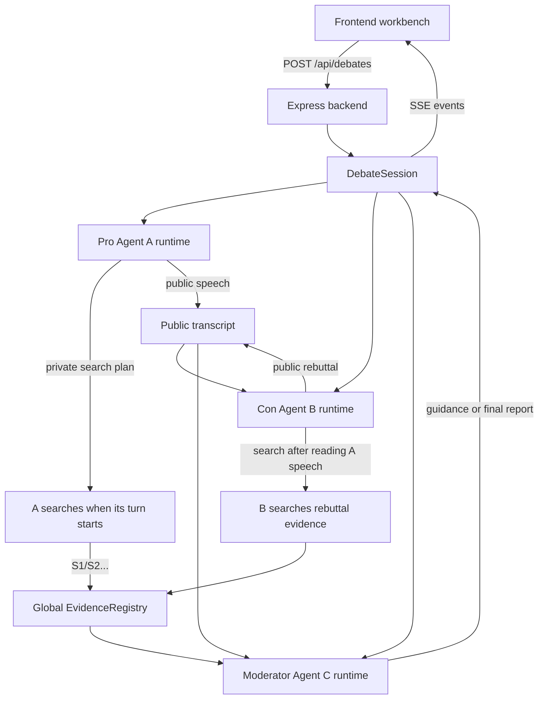

<p align="right">
  <a href="./README.md">简体中文</a> | <a href="./README.zh-TW.md">繁體中文</a> | <a href="./README.en.md">English</a> | <a href="./README.ja.md">日本語</a> | <a href="./README.ko.md">한국어</a>
</p>

<div align="center">
  

  <h1>Cicero Machine</h1>

  <p>
    <strong>バックエンド型 3 独立 Agent 討論ワークベンチ</strong><br />
    賛成・反対の Agent が発言順に検索して討論し、Moderator が証拠、数式、最終結論をまとめます。
  </p>

  <p>
    
    
    
    
    
    
  </p>
</div>

## これは何？

Cicero Machine は、バックエンド Agent サービスとフロントエンドのワークベンチで構成される調査・討論ツールです。論題と API Key を入力すると、バックエンドはメモリ上に討論 session を作成し、3 つの独立した AgentRuntime を実行します。

| Agent | 役割 | 独立状態 | 内容 |
| --- | --- | --- | --- |
| A | 賛成側 | 独立 history、memory、source pool、search log | 自分の発言前に支持証拠を検索し、賛成側の論点を組み立て、反論に応答します |
| B | 反対側 | 独立 history、memory、source pool、search log | A の現在ラウンド発言を読んでから反例やリスクを検索し、前提を攻撃します |
| C | Moderator | 独立 memory、guidance、audit log | ラウンド間レビュー、次の問いの提示、最終 Markdown レポートの生成を行います |

A/B/C は private conversation history を共有しません。共有するのは、バックエンド orchestrator を通じた公開発言、グローバル source ID、ユーザー追加要素、Moderator guidance だけです。1 つの DeepSeek または他の LLM API Key を 3 Agent で共用できます。

## 主な機能

- **3 つの独立 AgentRuntime**：A/B/C はバックエンド側で別々の history、memory、証拠プール、検索ログ、audit state を持ちます。
- **発言順のシリアル検索**：各ラウンドで A が検索して発言し、B は A の現在発言を読んでから検索して反論します。検索 API の同時実行による rate limit を抑えます。
- **Web 証拠検索**：Bocha API、Tavily API、OpenAI/Anthropic native search、hybrid mode に対応。
- **DeepSeek 対応**：DeepSeek OpenAI-compatible Chat Completions を標準対応し、同じ API Key を全 Agent で使えます。
- **グローバル source ID**：バックエンド `EvidenceRegistry` が `S1/S2/S3...` を採番し、URL を全体で重複排除し、どの Agent・ラウンド・query が発見または引用したかを記録します。
- **クリック可能な出典**：本文中の `[S1]`、`[S2]` は出典リンクとして表示されます。
- **Moderator guidance を次ラウンドへ反映**：C の問いは A/B に broadcast され、次回検索と発言 task に注入されます。
- **一時停止と再開**：討論を一時停止し、新しい考慮要素を追加して続行できます。
- **最終結論の Markdown 表示**：見出し、リスト、表、リンク、source 参照をアプリ内で表示。
- **自動継続と fallback**：最終レポートが途中で切れた場合は自動継続し、モデル呼び出しが 2 回失敗した場合は明示的に labeled local fallback Markdown を表示します。
- **Markdown エクスポート**：最終レポート、証拠 URL、source attribution、全 transcript を出力できます。

## ワークフロー



## クイックスタート

```bash
npm install
npm run dev
```

`npm run dev` は Express backend `http://127.0.0.1:8787` と Vite frontend `http://127.0.0.1:8000/debate.html` を同時に起動します。

ページ上で LLM API Key、Search API Key、モデル名を入力します。API Key は現在のブラウザの `localStorage` に保存され、討論開始時に今回のバックエンド in-memory session へ送られるだけです。バックエンドは DB へ保存せず、永続化もしません。

## コマンド

| コマンド | 説明 |
| --- | --- |
| `npm run dev` | バックエンドと Vite フロントエンドを同時起動し、`/debate.html` を開きます |
| `npm run dev:server` | Express backend TypeScript watcher だけを起動 |
| `npm run dev:web` | Vite frontend だけを起動し、`/api` を backend に proxy |
| `npm run check` | TypeScript 型チェック |
| `npm run test` | Vitest 単体テストを実行 |
| `npm run build` | フロントエンド本番 assets をビルドし、型チェックも実行 |
| `npm start` | 本番モードで Express backend を起動し、`dist/` を配信 |
| `npm run preview` | Vite 静的ビルドだけを preview。backend agent API は動きません |

## デプロイ

現在のバージョンは静的フロントエンドだけではありません。本番デプロイには長時間実行できる Node.js service が必要です。ビルド後、Express backend が `dist/` を配信し、`/api/debates` と SSE event stream を提供します。

```bash
npm install
npm run build
npm start
```

デフォルトの本番 URL は `http://127.0.0.1:8787/debate.html` です。`PORT=3000 npm start` でポートを変更できます。

| シナリオ | 推奨 |
| --- | --- |
| ローカルまたはイントラネット | `npm start` を実行し、必要なら Nginx/Caddy を前段に置く |
| VPS / クラウドサーバー | Node.js を入れ、`npm run build && npm start` を実行し、HTTPS reverse proxy を追加 |
| Render / Railway / Fly.io などの Node host | Build Command: `npm install && npm run build`; Start Command: `npm start` |
| Vercel / Netlify static hosting | Express API と SSE が必要なため、静的ホスティングだけでは不向き |
| GitHub Pages | backend agent service を実行できないため、現在の構成には不向き |

## セキュリティとコスト

現在の呼び出し経路は Browser -> Express Backend -> A/B/C AgentRuntime -> LLM/Search Providers です。バックエンドは API Key を永続化しませんが、公開デプロイではユーザーの Key があなたのサーバーへ送られます。そのため HTTPS を使い、ユーザーがその deployment を信頼できる必要があります。

- API Key をソースコードにハードコードしないでください。
- まだユーザーシステム、データベース、tenant isolation はありません。公開運用する場合は、認証、rate limit、ログの秘匿化、コスト制御、session cleanup を追加してください。
- 検索 API には rate limit や quota があります。現在は発言順にシリアル検索し、単発の検索失敗は degrade しますが、quota が尽きた場合は provider warning が表示されます。

## プロジェクト構成

```text
.
├── debate.html                 # Vite HTML entry, keeps /debate.html
├── src                         # Frontend workbench
│   ├── main.ts                 # DOM binding, SSE event apply, rendering, export trigger
│   ├── config.ts               # Provider presets and default config
│   ├── types.ts                # Shared frontend/backend core types
│   ├── services                # Frontend debateClient and lightweight HTTP helper
│   └── ui                      # Icons, Markdown rendering, source links
├── server                      # Backend agent service
│   ├── index.ts                # Express API, SSE, production static hosting
│   ├── domain                  # agents, orchestrator, evidenceRegistry
│   ├── services                # LLM, search, finance, HTTP timeout
│   └── mock.ts                 # ?mock=1 regression data
├── docs/assets                 # README visual assets
├── vite.config.ts              # Vite dev server and /api proxy
└── package.json
```

## バックエンド API

| API | 目的 |
| --- | --- |
| `POST /api/debates` | 討論 session を作成して開始 |
| `GET /api/debates/:id/events` | SSE で status、message、evidence、final report、error を配信 |
| `POST /api/debates/:id/pause` | 現在の API 呼び出し後に一時停止 |
| `POST /api/debates/:id/resume` | ユーザー追加要素を送って再開 |
| `POST /api/debates/:id/stop` | 現在の討論を停止 |
| `GET /api/debates/:id/export` | 現在の Markdown レポートを export |

## 対応 Provider

### LLM

- DeepSeek
- OpenAI-compatible custom services
- Anthropic Messages
- Qwen / DashScope
- Moonshot / Kimi
- Zhipu GLM
- Doubao / Volcengine
- SiliconFlow
- OpenRouter

### Search

- Bocha API
- Tavily API
- LLM native search
- Hybrid mode

## 開発メモ

- 3 Agent の private history は混ざらず、public transcript、source ID、guidance だけを共有します。
- すべての出典は `EvidenceItem` として統一され、backend が global source ID を付与します。
- A/B の発言は提供済み source ID を引用する必要があり、偽の出典を減らします。
- 金融・マーケットデータは構造化証拠を優先し、通常の Web ページは背景情報として扱います。
- Moderator の最終レポートは rendered Markdown として表示され、元の Markdown も export できます。
- `?mock=1` で実 API Key なしに 1 から 10 ラウンドの回帰テストを実行できます。

## License

このプロジェクトは [MIT License](./LICENSE) の下で公開されています。
