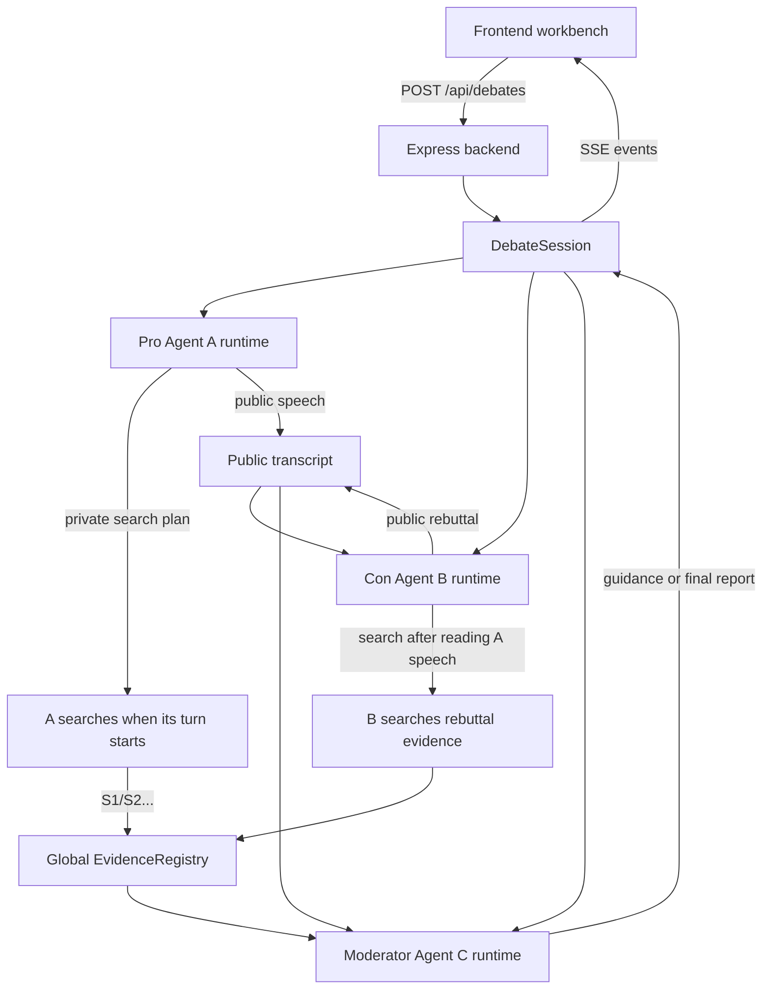

<p align="right">
  <a href="./README.md">简体中文</a> | <a href="./README.zh-TW.md">繁體中文</a> | <a href="./README.en.md">English</a> | <a href="./README.ja.md">日本語</a> | <a href="./README.ko.md">한국어</a>
</p>

<div align="center">
  

  <h1>Cicero Machine</h1>

  <p>
    <em>"In disputando veritas gignitur."</em><br />
    진리는 토론 속에서 태어난다——키케로（Marcus Tullius Cicero）
  </p>

  <p>
    <strong>백엔드 기반 3개 독립 Agent 토론 워크벤치</strong><br />
    찬반 Agent가 발언 순서에 맞춰 검색하고 토론한 뒤, Moderator가 근거, 공식, 최종 결론을 정리합니다.
  </p>

  <p>
    
    
    
    
    
    
  </p>
</div>

## 이 프로젝트는 무엇인가요?

Cicero Machine은 백엔드 Agent 서비스와 프론트엔드 워크벤치로 구성된 리서치 및 토론 도구입니다. 주제와 API Key를 입력하면 백엔드가 메모리 기반 debate session을 만들고, 세 개의 독립 AgentRuntime을 실행합니다.

| Agent | 역할 | 독립 상태 | 하는 일 |
| --- | --- | --- | --- |
| A | 찬성 측 | 독립 history, memory, source pool, search log | 자기 발언 전에 지지 근거를 검색하고 찬성 논리를 구성하며 반론에 대응합니다 |
| B | 반대 측 | 독립 history, memory, source pool, search log | A의 현재 라운드 발언을 본 뒤 반례와 리스크를 검색하고 가정을 공격합니다 |
| C | Moderator | 독립 memory, guidance, audit log | 라운드별 코멘트, 다음 질문 제시, 최종 Markdown 리포트 생성을 담당합니다 |

A/B/C는 private conversation history를 공유하지 않습니다. 백엔드 orchestrator를 통해 공개 발언, 전역 source ID, 사용자 추가 요소, moderator guidance만 교환합니다. 하나의 DeepSeek 또는 다른 LLM API Key를 세 Agent가 함께 사용할 수 있습니다.

## 주요 기능

- **세 개의 독립 AgentRuntime**: A/B/C는 백엔드에서 각각 별도의 history, memory, evidence pool, search log, audit state를 유지합니다.
- **발언 순서 기반 직렬 검색**: 각 라운드에서 A가 먼저 검색하고 발언하며, B는 A의 현재 발언을 읽은 뒤 검색하고 반박합니다. 검색 API 동시 호출로 인한 rate limit 가능성을 낮춥니다.
- **웹 증거 검색**: Bocha API, Tavily API, OpenAI/Anthropic native search, hybrid mode를 지원합니다.
- **DeepSeek 지원**: DeepSeek OpenAI-compatible Chat Completions를 기본 지원하며, 같은 API Key를 모든 Agent가 사용할 수 있습니다.
- **전역 source ID**: 백엔드 `EvidenceRegistry`가 `S1/S2/S3...`를 부여하고 URL을 전역 dedupe하며, 각 source를 어떤 Agent, 라운드, query가 발견하거나 인용했는지 기록합니다.
- **클릭 가능한 출처**: 본문 `[S1]`, `[S2]`가 출처 링크로 렌더링됩니다.
- **Moderator guidance가 다음 라운드에 반영**: C의 후속 질문이 A/B에 broadcast되고 다음 검색 및 발언 task에 주입됩니다.
- **일시정지와 재개**: 토론을 멈추고 새로운 고려 요소를 추가한 뒤 계속할 수 있습니다.
- **최종 Markdown 렌더링**: 제목, 목록, 표, 링크, source reference를 앱 안에서 미리 볼 수 있습니다.
- **자동 이어쓰기와 fallback**: 최종 보고서가 잘리면 자동으로 이어 쓰며, 모델 호출이 두 번 실패하면 명확히 표시된 local fallback Markdown을 렌더링합니다.
- **Markdown 내보내기**: 최종 보고서, evidence URL, source ownership, 전체 transcript를 내보낼 수 있습니다.

## 워크플로



## 빠른 시작

```bash
npm install
npm run dev
```

`npm run dev`는 Express backend `http://127.0.0.1:8787`와 Vite frontend `http://127.0.0.1:8000/debate.html`를 동시에 시작합니다.

페이지에서 LLM API Key, Search API Key, 모델명을 입력합니다. API Key는 현재 브라우저의 `localStorage`에 저장되고 토론 시작 시 이번 백엔드 in-memory session에만 전송됩니다. 백엔드는 DB에 쓰거나 영구 저장하지 않습니다.

## 명령어

| 명령어 | 설명 |
| --- | --- |
| `npm run dev` | 백엔드와 Vite 프론트엔드를 함께 시작하고 `/debate.html`을 엽니다 |
| `npm run dev:server` | Express backend TypeScript watcher만 시작 |
| `npm run dev:web` | Vite frontend만 시작하고 `/api`는 backend로 proxy |
| `npm run check` | TypeScript 타입 검사 |
| `npm run test` | Vitest 단위 테스트 실행 |
| `npm run build` | 프론트엔드 프로덕션 assets 빌드 및 타입 검사 |
| `npm start` | 프로덕션 모드 Express backend 시작 및 `dist/` 서빙 |
| `npm run preview` | Vite 정적 빌드만 preview. backend agent API는 실행하지 않습니다 |

## 배포

현재 버전은 더 이상 정적 프론트엔드만으로 동작하지 않습니다. 프로덕션 배포에는 장시간 실행 가능한 Node.js 서비스가 필요합니다. 빌드 후 Express backend가 `dist/`를 서빙하고 `/api/debates` 및 SSE event stream을 제공합니다.

```bash
npm install
npm run build
npm start
```

기본 프로덕션 URL은 `http://127.0.0.1:8787/debate.html`입니다. `PORT=3000 npm start`로 포트를 바꿀 수 있습니다.

| 시나리오 | 권장 방식 |
| --- | --- |
| 로컬 또는 인트라넷 사용 | `npm start` 실행, 필요하면 Nginx/Caddy reverse proxy 사용 |
| VPS / 클라우드 서버 | Node.js 설치 후 `npm run build && npm start`, 앞단에 HTTPS reverse proxy 추가 |
| Render / Railway / Fly.io 같은 Node host | Build Command: `npm install && npm run build`; Start Command: `npm start` |
| Vercel / Netlify static hosting | Express API와 SSE가 필요하므로 정적 배포만으로는 부적합 |
| GitHub Pages | backend agent service를 실행할 수 없어 현재 구조에는 부적합 |

## 보안 및 비용 주의사항

현재 호출 흐름은 Browser -> Express Backend -> A/B/C AgentRuntime -> LLM/Search Providers입니다. 백엔드는 API Key를 영구 저장하지 않지만, 공개 배포에서는 사용자의 Key가 운영자가 배포한 서버로 전송됩니다. HTTPS를 사용하고 사용자가 해당 배포를 신뢰할 수 있어야 합니다.

- API Key를 소스 코드에 하드코딩하지 마세요.
- 아직 사용자 시스템, 데이터베이스, tenant isolation이 없습니다. 장기 공개 운영 전에는 인증, rate limit, 로그 마스킹, 비용 제어, session cleanup을 추가하세요.
- Search API에는 rate limit이나 quota가 있을 수 있습니다. 현재 구현은 발언 순서에 따라 직렬 검색하고 단일 검색 실패를 degrade하지만, 계정 quota가 소진되면 provider warning이 표시됩니다.

## 프로젝트 구조

```text
.
├── debate.html                 # Vite HTML entry, keeps /debate.html
├── src                         # Frontend workbench
│   ├── main.ts                 # DOM binding, SSE event apply, rendering, export trigger
│   ├── config.ts               # Provider presets and default config
│   ├── types.ts                # Shared frontend/backend core types
│   ├── services                # Frontend debateClient and lightweight HTTP helper
│   └── ui                      # Icons, Markdown rendering, source links
├── server                      # Backend agent service
│   ├── index.ts                # Express API, SSE, production static hosting
│   ├── domain                  # agents, orchestrator, evidenceRegistry
│   ├── services                # LLM, search, finance, HTTP timeout
│   └── mock.ts                 # ?mock=1 regression data
├── docs/assets                 # README visual assets
├── vite.config.ts              # Vite dev server and /api proxy
└── package.json
```

## 백엔드 API

| API | 용도 |
| --- | --- |
| `POST /api/debates` | debate session 생성 및 시작 |
| `GET /api/debates/:id/events` | SSE로 status, message, evidence, final report, error 전송 |
| `POST /api/debates/:id/pause` | 현재 API 호출이 끝난 뒤 일시정지 요청 |
| `POST /api/debates/:id/resume` | 사용자 추가 요소를 제출하고 계속 |
| `POST /api/debates/:id/stop` | 현재 토론 중단 |
| `GET /api/debates/:id/export` | 현재 Markdown 보고서 내보내기 |

## 지원 Provider

### LLM

- DeepSeek
- OpenAI-compatible custom services
- Anthropic Messages
- Qwen / DashScope
- Moonshot / Kimi
- Zhipu GLM
- Doubao / Volcengine
- SiliconFlow
- OpenRouter

### Search

- Bocha API
- Tavily API
- LLM native search
- Hybrid mode

## 개발 메모

- 세 Agent의 private history는 서로 섞이지 않으며 public transcript, source ID, guidance만 공유합니다.
- 모든 근거는 `EvidenceItem`으로 통합되고 backend가 global source ID를 부여합니다.
- A/B 발언은 제공된 source ID를 인용해야 하며, 가짜 출처 생성을 줄입니다.
- 금융 및 시장 데이터는 구조화된 증거를 우선 사용하고 일반 웹 페이지는 배경 자료로만 사용합니다.
- Moderator 최종 보고서는 rendered Markdown으로 표시되며 원본 Markdown도 export할 수 있습니다.
- `?mock=1`로 실제 API Key 없이 1~10 라운드 회귀 테스트를 실행할 수 있습니다.

## License

이 프로젝트는 [MIT License](./LICENSE)로 공개됩니다.
