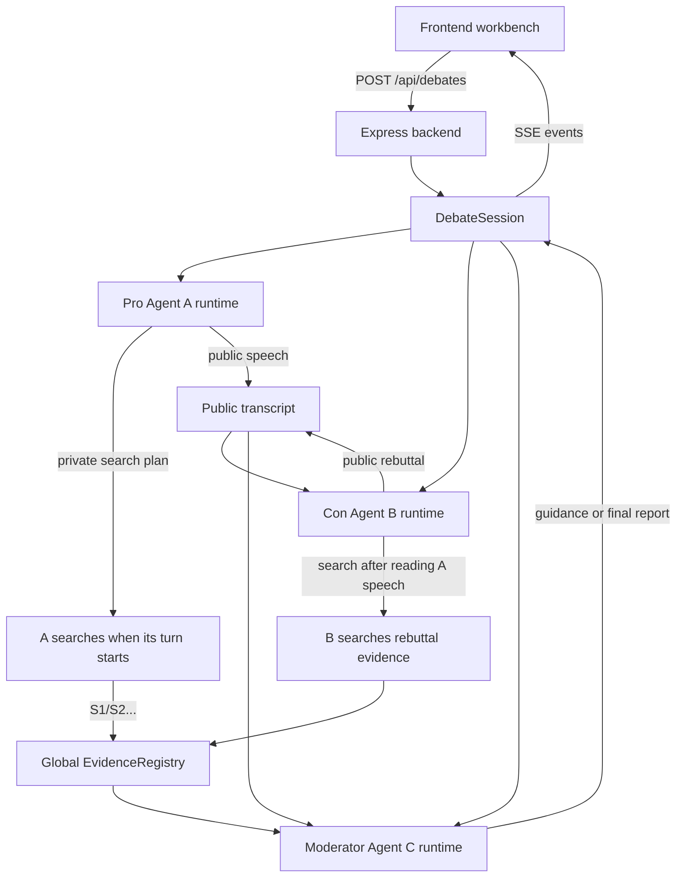

<p align="right">
  <a href="./README.md">简体中文</a> | <a href="./README.zh-TW.md">繁體中文</a> | <a href="./README.en.md">English</a> | <a href="./README.ja.md">日本語</a> | <a href="./README.ko.md">한국어</a>
</p>

<div align="center">
  

  <h1>Cicero Machine</h1>

  <p>
    <strong>後端三獨立 Agent 辯論工作台</strong><br />
    讓正反雙方依發言順序聯網搜尋與辯論，再由主持人彙總證據、公式與最終結論。
  </p>

  <p>
    
    
    
    
    
    
  </p>
</div>

## 這是什麼？

Cicero Machine 是一個「後端 Agent 服務 + 前端工作台」的研究與辯論工具。輸入辯題與 API Key 後，後端會建立一次記憶體中的辯論 session，並執行三個獨立的 AgentRuntime：

| Agent | 角色 | 獨立狀態 | 做什麼 |
| --- | --- | --- | --- |
| A | 正方 | 獨立 history、memory、source pool、search log | 輪到自己發言前搜尋支持性證據，建立正方論點，回應反方挑戰 |
| B | 反方 | 獨立 history、memory、source pool、search log | 看到 A 當前輪發言後搜尋反例與風險證據，攻擊正方假設 |
| C | 主持人 | 獨立 memory、guidance、audit log | 輪間點評、提出下一步追問，最後生成 Markdown 研究報告 |

A/B/C 不共享私有對話歷史，只透過後端 orchestrator 交換公開發言、全域 source ID、使用者補充因素與主持人 guidance。一個 DeepSeek 或其他 LLM API Key 可以同時供三名 agent 使用。

## 功能亮點

- **三套獨立 AgentRuntime**：A/B/C 在後端分別維護自己的 history、memory、證據池、搜尋記錄與審計狀態。
- **依發言順序串行搜尋**：每輪 A 先查再講，B 看到 A 當前輪發言後再查再反駁，降低搜尋 API 併發觸發限流的機率。
- **聯網搜尋證據**：支援博查 API、Tavily API、OpenAI/Anthropic 原生搜尋與混合模式。
- **DeepSeek 適配**：預設支援 DeepSeek OpenAI-compatible Chat Completions，可共用同一個 API Key。
- **全域來源編號**：後端 `EvidenceRegistry` 統一分配 `S1/S2/S3...`，URL 全域去重，並記錄每個 source 由哪個 agent、哪一輪、哪個 query 發現或引用。
- **來源可點擊**：正文中的 `[S1]`、`[S2]` 會渲染為來源連結。
- **主持人引導進入下一輪**：C 的輪間追問會廣播給 A/B，並注入下一輪搜尋與發言任務。
- **暫停繼續**：使用者可以暫停辯論，補充新的考慮因素，再讓 agent 繼續。
- **最終結論 Markdown 渲染**：標題、列表、表格、連結與 source 引用都能線上預覽。
- **截斷自動續寫與失敗 fallback**：最終總結被截斷時會自動續寫；兩次模型呼叫都失敗時會生成明確標註的本地 fallback Markdown。
- **匯出 Markdown**：辯論完成後可匯出最終報告、證據 URL、來源歸屬與完整辯論記錄。

## 工作流程



## 快速開始

```bash
npm install
npm run dev
```

`npm run dev` 會同時啟動 Express 後端 `http://127.0.0.1:8787` 與 Vite 前端 `http://127.0.0.1:8000/debate.html`。

在頁面中填入 LLM API Key、搜尋 API Key 與模型名稱。API Key 保存在目前瀏覽器的 `localStorage`，開始辯論時只送給本次後端記憶體 session；後端不寫入資料庫，也不持久化保存 Key。

## 常用命令

| 命令 | 說明 |
| --- | --- |
| `npm run dev` | 同時啟動後端與 Vite 前端，並開啟 `/debate.html` |
| `npm run dev:server` | 只啟動 Express 後端 TypeScript watcher |
| `npm run dev:web` | 只啟動 Vite 前端，`/api` 代理到後端 |
| `npm run check` | TypeScript 型別檢查 |
| `npm run test` | 執行 Vitest 單元測試 |
| `npm run build` | 建置前端生產產物並做型別檢查 |
| `npm start` | 生產模式啟動 Express 後端，並托管 `dist/` |
| `npm run preview` | 僅預覽 Vite 靜態構建，不會執行後端 agent API |

## 部署

目前版本不再是純靜態前端，生產部署需要可以長時間執行 Node.js 的服務。建置後由 Express 後端托管 `dist/`，並提供 `/api/debates` 與 SSE 事件流。

```bash
npm install
npm run build
npm start
```

預設生產地址是 `http://127.0.0.1:8787/debate.html`，可用 `PORT=3000 npm start` 修改端口。

| 場景 | 建議 |
| --- | --- |
| 本機或內網使用 | 直接 `npm start`，可選擇加 Nginx/Caddy 反向代理 |
| VPS / 雲端伺服器 | 安裝 Node.js，執行 `npm run build && npm start`，前面放 HTTPS 反向代理 |
| Render / Railway / Fly.io 等 Node 平台 | Build Command: `npm install && npm run build`; Start Command: `npm start` |
| Vercel / Netlify 靜態托管 | 不適合作為純靜態部署，因為需要 Express API 與 SSE |
| GitHub Pages | 不適合目前架構，只能托管前端，不能執行後端 agent 服務 |

## 安全與費用注意

目前呼叫鏈是 Browser -> Express Backend -> A/B/C AgentRuntime -> LLM/Search Providers。後端不持久化 API Key，但公開部署時使用者 Key 仍會送到你部署的伺服器，因此必須使用 HTTPS，並確保使用者信任該服務。

- 不要在程式碼中硬編碼 API Key。
- 目前沒有使用者系統、資料庫與租戶隔離；多人長期公開使用前，需要補上認證、限流、日誌脫敏、費用控制與 session 清理策略。
- 搜尋 API 可能有頻率限制。當前實作已依發言順序串行搜尋，並對單次搜尋失敗做降級，但帳號額度耗盡仍會回傳 provider warning。

## 專案結構

```text
.
├── debate.html                 # Vite HTML 入口，保留 /debate.html
├── src                         # 前端工作台
│   ├── main.ts                 # DOM 綁定、SSE event apply、渲染與匯出觸發
│   ├── config.ts               # Provider presets 與預設設定
│   ├── types.ts                # 前後端共用核心型別
│   ├── services                # 前端 debateClient 與輕量 HTTP helper
│   └── ui                      # 圖示、Markdown 渲染、source 連結
├── server                      # 後端 agent 服務
│   ├── index.ts                # Express API、SSE、生產靜態資源托管
│   ├── domain                  # agents、orchestrator、evidenceRegistry
│   ├── services                # LLM、搜尋、金融行情、HTTP timeout
│   └── mock.ts                 # ?mock=1 回歸測試資料
├── docs/assets                 # README 視覺素材
├── vite.config.ts              # Vite dev server 與 /api proxy
└── package.json
```

## 後端 API

| API | 用途 |
| --- | --- |
| `POST /api/debates` | 建立並啟動一次辯論 session |
| `GET /api/debates/:id/events` | 透過 SSE 推送狀態、訊息、證據、最終報告與錯誤 |
| `POST /api/debates/:id/pause` | 要求在目前 API 呼叫結束後暫停 |
| `POST /api/debates/:id/resume` | 提交使用者補充因素並繼續 |
| `POST /api/debates/:id/stop` | 停止目前辯論 |
| `GET /api/debates/:id/export` | 匯出目前 Markdown 報告 |

## 支援的 Provider

### LLM

- DeepSeek
- OpenAI-compatible 自訂服務
- Anthropic Messages
- Qwen / DashScope
- Moonshot / Kimi
- Zhipu GLM
- Doubao / Volcengine
- SiliconFlow
- OpenRouter

### Search

- Bocha API
- Tavily API
- LLM 原生搜尋
- 混合模式

## 開發說明

- 三個 agent 的私有 history 不互相污染，只共享公開 transcript、source ID 與 guidance。
- 所有證據統一為 `EvidenceItem`，並由後端分配全域 source ID。
- A/B 發言必須引用已提供的 source ID，以減少偽造來源。
- 財務與行情資料優先使用結構化證據，普通網頁只能作為背景材料。
- 主持人最終報告只以渲染後的 Markdown 展示，同時保留原始 Markdown 供匯出。
- `?mock=1` 可在沒有真實 API Key 的情況下跑通 1 到 10 輪回歸測試。

## License

目前尚未宣告授權條款。公開發布前建議補充 `LICENSE` 文件。
